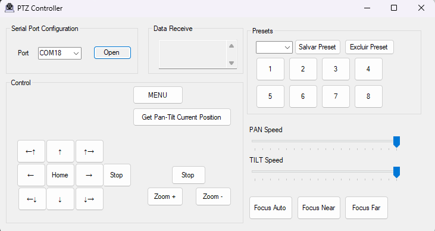

# Visca PTZ Controller for Windows

ViscaControllerPtz is a simple application for controlling PTZ (Pan-Tilt-Zoom) cameras using the VISCA protocol. It provides a user-friendly interface to send commands to PTZ cameras connected via serial port.

## Features

- Control PTZ cameras via serial port using the VISCA protocol.
- Supports commands for pan, tilt, zoom, presets.
- WebSocket server integration for remote control capability.
- Save and load settings for easy configuration.
  
## Application Screenshots

### Windows Application

### Web Interface

## Getting Started

To use ViscaControllerPtz, follow these steps:

1. **Download**: Clone this repository.
2. **Build**: If you prefer to build the application yourself, open the solution in Visual Studio and build the project.
3. **Connect**: Connect your PTZ camera to the computer using a serial port.
4. **Configure**: Run the application and configure the serial port settings and other options as needed.
5. **Control**: Use the buttons in the UI to control your PTZ camera or integrate with the WebSocket server for remote control.

> **Note**: The application is also available as a precompiled executable in the [Releases](https://github.com/rodrigobuen0/ViscaControllerPtz/releases) page.

## Requirements

- Windows operating system
- .NET Framework

## Using with OBS Studio

If you want to use ViscaControllerPtz with OBS Studio for streaming or recording, follow these additional steps:

1. **Open OBS Studio**: Start OBS Studio and add a new "Browser" source to your scene.
2. **Set URL**: Set the URL of the browser source to `http://localhost:8080/`.
3. **Position and Size**: Adjust the position and size of the browser source to fit your layout.

> **Note**: The web page served by the application runs on port `8080`, and the WebSocket server runs on port `8081`.

## Compatible Camera

This application is optimized for use with the CONFERENCE Mini PTZ 20X HDMI | USB 2.0 camera. While it may work with other PTZ cameras, it has not been extensively tested with them.

## Contributing

Contributions are welcome! If you find any issues or have suggestions for improvements, please open an issue or submit a pull request.

## Acknowledgments

- [WebSocketSharp](https://github.com/sta/websocket-sharp) - WebSocket library for C#
